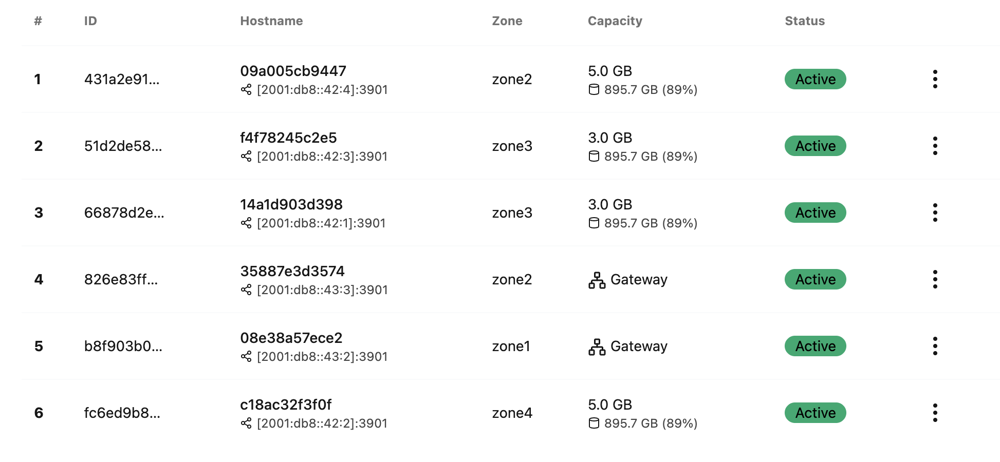

# garage S3 multi-host experiment

## Setup

> cf. https://garagehq.deuxfleurs.fr/documentation/cookbook/real-world/

```sh
docker compose up -d

docker exec -ti experiment-garage-s3-host2-1 /garage node id
docker exec -ti experiment-garage-s3-host3-1 /garage node id
docker exec -ti experiment-garage-s3-host4-1 /garage node id
# update host1/garage.toml with the above peer IDs and IPs, then restart host1
docker compose restart host1
```

## Example layout configuration

> Also doable via the web UI

You must adapt `f780`, `a267`, `889c`, and `1482`

```sh
alias garage="docker exec -ti experiment-garage-s3-host1-1 /garage"
garage status
garage layout assign f780 -z zone1 -c 3G -t host1
garage layout assign a267 -z zone1 -c 3G -t host2
garage layout assign 889c -z zone2 -c 5G -t giraffe
garage layout assign 1482 -z zone3 -c 5G -t squirrel
garage layout show
garage layout apply --version 1
```

In this screenshot, the gateway's layout is configured as a "gateway". This was done via the web UI.



## Gateway ?

> cf. https://garagehq.deuxfleurs.fr/documentation/cookbook/gateways/

Apps can access the S3 in three ways:
- connect to one of the storage nodes directly (using its IP). Not HA.
- enable s3_api in all hosts, setup a reverse proxy with load balancing. The bottleneck is the proxy, but at least the S3 endpoint is reachable from outside.
- ✅ setup a dedicated gateway node in the docker environment where consumers live. The gateway node connects to the storage nodes, and exposes the S3 API to consumers (and optionally the outside world). S3 therefore doesn't have to be reachable from outside. Storage nodes don't have to expose s3_api, only the gateway node.

## WebUI

> cf. https://github.com/khairul169/garage-webui

- requires admin API to be enabled in at least one node (storage or gateway)
- either :
  - expose the admin API port to the outside world with a reverse proxy. Reachable from outside world...
  - expose the admin API on one of the nodes, and hardcode its IP in the webUI config. Bof...
  - ✅ expose the admin API on a node (preferably a gateway node) running on the same docker network as the webUI container. The webUI container can reach the admin API via the docker network internal IP. Not reachable from outside world.

## TODO

- metrics : they are per-node. One can enable the admin API to export metrics without enabling the full admin API, so it makes it safe to expose metrics endpoints to the outside world.
  - cf. https://garagehq.deuxfleurs.fr/documentation/cookbook/monitoring/
  - cf. https://garagehq.deuxfleurs.fr/documentation/reference-manual/monitoring/
- webUI : host behind traefik reverse proxy with TLS and forward-auth middleware
- DNS?
  - give each node its own domain name: host1.s3.emrio.fr, etc.
  - two goals:
    - easier to identify nodes when configuring the cluster, either on `bootstrap_peers` or on the webUI
    - easier to identify nodes for monitoring in prometheus
